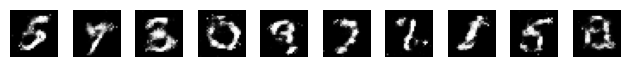
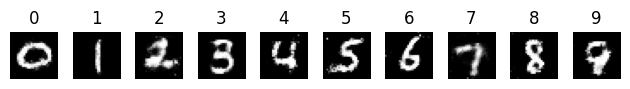
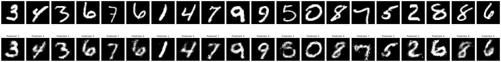

# GAN Implementation for MNIST Digit Synthesis

## Introduction

This repository showcases a minimalist yet effective implementation of Generative Adversarial Networks (GANs) for synthesizing MNIST digits. The model design adheres to deliberate guidelines focusing on simplicity and effectiveness, with a conscious choice to avoid convolutional layers and intricate structures.

### 1. Basic GAN Implementation

The basic GAN architecture features a concise design philosophy with both the generator and discriminator composed of only two layers and ReLU activation. The generator's output is obtained using tanh for its suitable image range, while the discriminator employs Sigmoid activation for probability output.

### 1.2 Conditional GAN Implementation

In the extension to conditional GANs (cGANs), the architecture remains identical to the basic GAN, allowing a fair comparison of the impact of additional class information on training speed and results. Class information is encoded using a one-hot encoder for simplicity, with a deliberate choice to maintain architectural similarity across models.

### 1.3 Integrating an Encoder into the GAN

The integration of an encoder into the cGAN introduces two new encoders—one functioning as a label predictor (classifier) and the other forming the encoder of an autoencoder with the cGAN’s generator as the decoder. This approach, inspired by [Per+16], simplifies training by leveraging the cGAN as a foundation model, maintaining architectural consistency across all models.

## Experimental Setup and Training Overview

Hyperparameters were selected based on common values without meticulous fine-tuning. Both GANs underwent training for approximately 400 epochs in 50-epoch intervals. The cGAN consistently demonstrated superior image quality, attributed to the incorporation of additional label information. Efficient training periods underline the effectiveness of the chosen methodologies.

## Results

Both GANs exhibited commendable performance, considering their compact size. Minor issues such as a lack of contrast in certain regions and noisy borders were observed. The Encoder-cGAN (E-cGAN) showcased exceptional results, faithfully reproducing input while retaining generator characteristics. Image reconstructions under specific labels demonstrated the model's ability to faithfully translate visual characteristics in a label-conditioned manner.

For examples and visualizations, refer to the notebook.

## References

- [Goodfellow et al., "Generative adversarial nets"](https://papers.nips.cc/paper/5423-generative-adversarial-nets)
- [Mirza and Osindero, "Conditional generative adversarial nets"](https://arxiv.org/abs/1411.1784)
- [Perarnau et al., "Invertible conditional GANs for image editing"](https://arxiv.org/abs/1611.06355)

---
**Note:** This README is based on the work of Alexi Canesse, ENS de Lyon, and MVA @ ENS Paris-Saclay as of 23rd November 2023.
